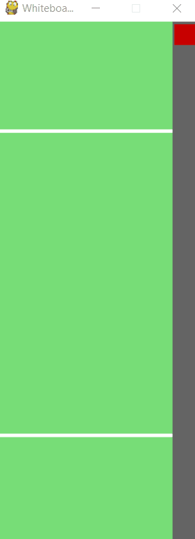
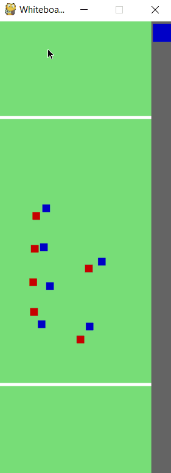
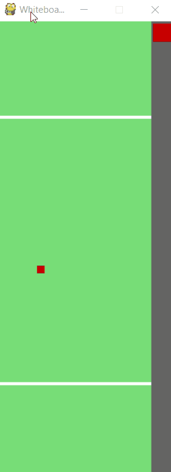
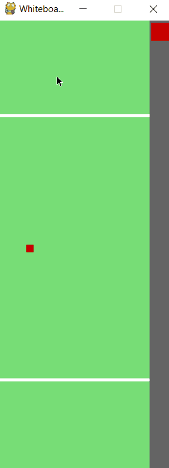

# Ultimate Frisbee Plays Simulator

## Animating Plays

## Functionality Examples

You can place offensive (red) and defensive (blue) players anywhere on the field by left clicking. Press the button on the top left corner to change teams. Clicking somewhere off the field does not place a player.

You can also delete a player by clicking on them and hitting backspace.

 

When you hover over a player, they become highlighted showing you can alter them by clicking on them. For offense, you can give the player a set of points to run between. Small dots indicate the path the offensive player will take.

Many offensive players can run in their paths simultaneously.

An offensive players path can also be expanded while the player is at the end of the path. Their path can also be reset back to the first position in the path by pressing r.

  

The offensive players' path can be cleared by clicking the player and pressing c.

When a defensive player is highlighted, you can assign them to play defense on an offensive player.

 
