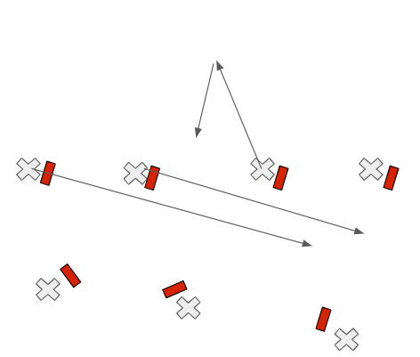
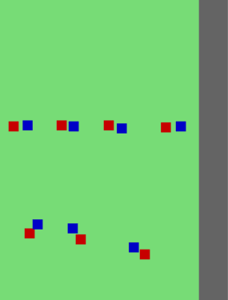
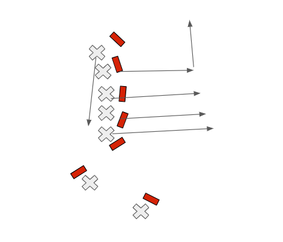
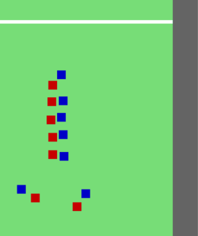
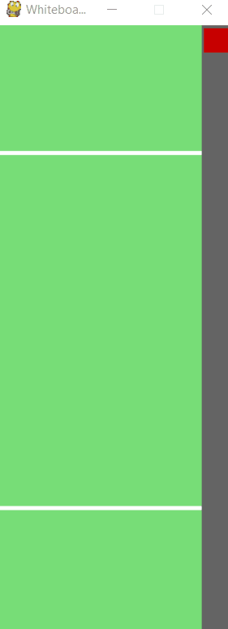
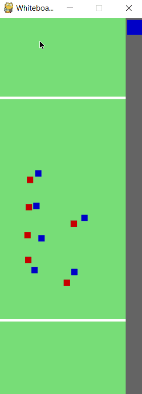
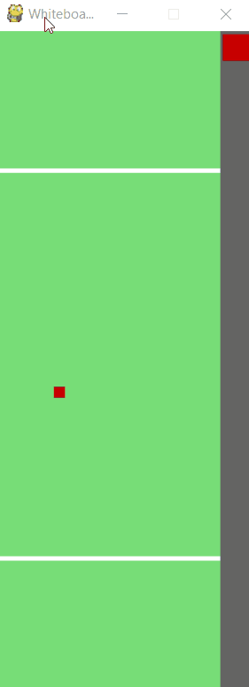
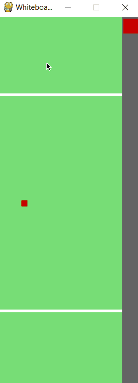

# Ultimate Frisbee Plays Simulator

## Purpose

The Ultimate Frisbee Plays Simulator is a tool for graphically creating and simulating ultimate frisbee plays. Below are two images of real ultimate frisbee plays, with the x's denoting offense and the bars denoting defense. Looking at the pictures, its unclear what the plays are designed to accomplish and why they work because we are dealing with a static image; we can't see the relative positions of the players before and after moving. However, the animated versions created using the simulator make the intent obvious. For instance, in the first play, all the downfield offensive players (in red) run to the side except one. As the play progresses, it becomes obvious that the one player who stayed now has lots of room to get open in, and the other players are nicely organized on the side of the field. In the second play, its again made clear that the one offender who stays in the middle has lots of space left behind by his teammates who ran to the side. Additionally, at the end of the play we can see that the offender furthest down the field is very naturally set up to run deep after the person below him gets open.

 

 

The simulator makes it easier to understand the purpose and function of real ultimate frisbee plays.

## How to Run

To run the simulator, you have to download and install the pygame library. Detailed instructions for doing so can be found here: https://www.pygame.org/wiki/GettingStarted. The simulator is built using the 1.9.6 package of pygame.

## Functionality Examples

You can place offensive (red) and defensive (blue) players anywhere on the field by left clicking. Press the button on the top left corner to change teams. Clicking somewhere off the field does not place a player.

You can also delete a player by clicking on them and hitting backspace.

 

When you hover over a player, they become highlighted showing you can alter them by clicking on them. For offense, you can give the player a set of points to run between. Small dots indicate the path the offensive player will take.

Many offensive players can run in their paths simultaneously.

An offensive players path can also be expanded while the player is at the end of the path. Their path can also be reset back to the first position in the path by pressing r.

  

The offensive players' path can be cleared by clicking the player and pressing c.

When a defensive player is highlighted, you can assign them to play defense on an offensive player.

 
